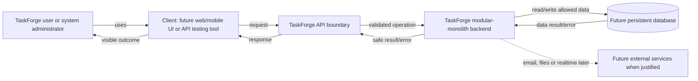

# TaskForge Architecture

## Current truth

TaskForge ka application code abhi create nahi hua hai. Isliye current software
architecture, modules, layers, imports, runtime processes ya database relationships
exist nahi karte. Yeh document future assumptions ko actual architecture ki tarah
present nahi karega.

## Product boundary

TaskForge ek learning-focused team project, task aur issue management backend hoga.
Planned product areas identity/access, workspaces/membership, projects, tasks,
collaboration, search/analytics, notifications aur production engineering hain.
Yeh product scope hai, implemented component list nahi.

## Conceptual actors and authority scopes

```text
Registered platform user/account
  -> Workspace A membership: owner/admin/member role
  -> Workspace B membership: independently owner/admin/member role

System administrator
  -> separate platform-level operational/moderation authority
```

Roles and membership are planned domain concepts only. No user/membership schema or
authorization code exists yet.

## Conceptual use-case entry

Actors TaskForge ko implementation layers directly operate karke use nahi karenge.
Woh product operations initiate karenge:

```text
Actor goal/trigger
  -> future client/API system boundary
  -> identity, permission and business-rule decisions
  -> allowed state/data change or read
  -> observable success or controlled failure
```

Detailed component diagram Topic 14 mein define hoga. Current use cases requirements
hain, running architecture nahi.

## Planned high-level system context



Diagram target relationships dikhata hai, implemented modules nahi. External-service
edge dashed hai kyunki woh later need par introduce hogi.

## Request-level conceptual boundary

```text
User
  |
  v
TaskForge client role
(future frontend could play this role inside a client runtime)
  |
  | future TaskForge API boundary
  | REQUEST: defined operation and relevant information
  v
TaskForge server role
(future backend code could execute inside a server-side runtime)
  |
  | rules and permission checks
  |
  | allowed data operation
  v
TaskForge database (future persistent data store)
  |
  | stored/read/changed data result
  v
TaskForge server role
  |
  | RESPONSE: defined success or failure result
  v
TaskForge client shows visible result to user
```

Client/server roles sirf conceptual hain; application code implement nahi hua.
Frontend client ki role play kar sakta hai aur backend server ki, lekin terms exact
synonyms nahi hain. Database box bhi conceptual hai; database technology, schema ya
connection implement nahi hui. API boundary conceptual hai; actual method, URL,
schema ya endpoint define/implement nahi hua. Request/response directions are now
conceptually shown; HTTP message anatomy later Phase 6 mein add hogi.

Runtime labels bhi conceptual hain. Browser aur Node.js jaise runtime choices ka
implementation/verification abhi nahi hua; architecture mein koi running process
exist karne ka claim nahi hai.

Source-code files aur running-process instances ko separate architecture concepts
maana jayega. Current TaskForge mein application source file bhi nahi bani aur
operating-system-managed TaskForge process bhi start nahi hua.

## Environment boundary

TaskForge future mein at least do different execution contexts use karega:

```text
Local development
  developer-owned process + safe development configuration/data
  -> verified/versioned change
  -> controlled deployment
Production
  production process + protected production configuration/data + real users
```

Yeh planned conceptual boundary hai, implemented architecture nahi. Current workspace
mein development ya production application process/configuration exist nahi karti.

## Architecture evolution rule

```text
Mental model -> tools/language/runtime -> HTTP/Express -> config/database
-> domain model/layers -> first vertical feature -> broader capabilities
```

Future layer ko empty ceremony ke roop mein pehle create nahi karenge. Current actual
architecture documentation-only hai.

## Documentation relationships

```text
TASKFORGE_BACKEND_MASTER_PLAN.md -> complete canonical curriculum/contract
notes/BACKEND_ROADMAP.md         -> ordered topic status
notes/LEARNING_STATE.md          -> chronological progress/evidence/next topic
notes/ARCHITECTURE.md            -> actual current architecture relationships
notes/API_CONTRACT.md            -> actual API behaviour only
notes/DEBUG_LOG.md               -> meaningful evidence-based incidents
notes/topics/phase-N/            -> topic lessons and exercises
notes/each-code-file/            -> future source/config file explanations
```

These documents preserve learning state across chats. Detailed operating contract is
in `notes/LEARNING_SYSTEM.md`.

## Development tooling context

Current verified command environment:

```text
Developer
  -> terminal host: ConsoleHost
  -> shell process: pwsh
  -> PowerShell edition/version: Core 7.6.5
  -> current workspace: C:\Users\ajaym\Desktop\Practicle
```

Yeh development tooling context hai, TaskForge application architecture nahi. No
TaskForge server process/project-root application exists yet.

## Implemented file relationships

None. Abhi sirf learning documentation hai.
