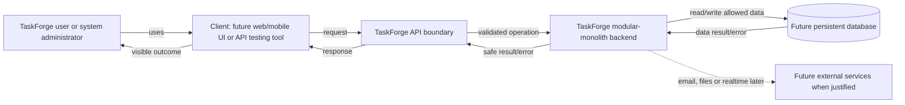

# TaskForge Architecture

## Current truth

TaskForge ka application code abhi create nahi hua hai. Isliye current software
architecture, modules, layers, imports, runtime processes ya database relationships
exist nahi karte. Yeh document future assumptions ko actual architecture ki tarah
present nahi karega.

## Product boundary

TaskForge ek learning-focused team project, task aur issue management backend hoga.
Planned product areas identity/access, workspaces/membership, projects, tasks,
collaboration, search/analytics, notifications aur production engineering hain.
Yeh product scope hai, implemented component list nahi.

## Conceptual actors and authority scopes

```text
Registered platform user/account
  -> Workspace A membership: owner/admin/member role
  -> Workspace B membership: independently owner/admin/member role

System administrator
  -> separate platform-level operational/moderation authority
```

Roles and membership are planned domain concepts only. No user/membership schema or
authorization code exists yet.

## Conceptual use-case entry

Actors TaskForge ko implementation layers directly operate karke use nahi karenge.
Woh product operations initiate karenge:

```text
Actor goal/trigger
  -> future client/API system boundary
  -> identity, permission and business-rule decisions
  -> allowed state/data change or read
  -> observable success or controlled failure
```

Detailed component diagram Topic 14 mein define hoga. Current use cases requirements
hain, running architecture nahi.

## Planned high-level system context



Diagram target relationships dikhata hai, implemented modules nahi. External-service
edge dashed hai kyunki woh later need par introduce hogi.

## Request-level conceptual boundary

```text
User
  |
  v
TaskForge client role
(future frontend could play this role inside a client runtime)
  |
  | future TaskForge API boundary
  | REQUEST: defined operation and relevant information
  v
TaskForge server role
(future backend code could execute inside a server-side runtime)
  |
  | rules and permission checks
  |
  | allowed data operation
  v
TaskForge database (future persistent data store)
  |
  | stored/read/changed data result
  v
TaskForge server role
  |
  | RESPONSE: defined success or failure result
  v
TaskForge client shows visible result to user
```

Client/server roles sirf conceptual hain; application code implement nahi hua.
Frontend client ki role play kar sakta hai aur backend server ki, lekin terms exact
synonyms nahi hain. Database box bhi conceptual hai; database technology, schema ya
connection implement nahi hui. API boundary conceptual hai; actual method, URL,
schema ya endpoint define/implement nahi hua. Request/response directions are now
conceptually shown; HTTP message anatomy later Phase 6 mein add hogi.

Runtime labels bhi conceptual hain. Browser aur Node.js jaise runtime choices ka
implementation/verification abhi nahi hua; architecture mein koi running process
exist karne ka claim nahi hai.

Source-code files aur running-process instances ko separate architecture concepts
maana jayega. Current TaskForge mein application source file bhi nahi bani aur
operating-system-managed TaskForge process bhi start nahi hua.

## Environment boundary

TaskForge future mein at least do different execution contexts use karega:

```text
Local development
  developer-owned process + safe development configuration/data
  -> verified/versioned change
  -> controlled deployment
Production
  production process + protected production configuration/data + real users
```

Yeh planned conceptual boundary hai, implemented architecture nahi. Current workspace
mein development ya production application process/configuration exist nahi karti.

## Architecture evolution rule

```text
Mental model -> tools/language/runtime -> HTTP/Express -> config/database
-> domain model/layers -> first vertical feature -> broader capabilities
```

Future layer ko empty ceremony ke roop mein pehle create nahi karenge. Current actual
architecture documentation-only hai.

## Documentation relationships

```text
TASKFORGE_BACKEND_MASTER_PLAN.md -> complete canonical curriculum/contract
notes/BACKEND_ROADMAP.md         -> ordered topic status
notes/LEARNING_STATE.md          -> chronological progress/evidence/next topic
notes/ARCHITECTURE.md            -> actual current architecture relationships
notes/API_CONTRACT.md            -> actual API behaviour only
notes/DEBUG_LOG.md               -> meaningful evidence-based incidents
notes/topics/phase-N/            -> topic lessons and exercises
notes/each-code-file/            -> future source/config file explanations
```

These documents preserve learning state across chats. Detailed operating contract is
in `notes/LEARNING_SYSTEM.md`.

## Development tooling context

Current verified command environment:

```text
Developer
  -> terminal host: ConsoleHost
  -> shell process: pwsh
  -> PowerShell edition/version: Core 7.6.5
  -> current workspace: C:\Users\ajaym\Desktop\Practicle
```

Yeh development tooling context hai, TaskForge application architecture nahi. No
TaskForge server process/project-root application exists yet.

Current command interaction model:

```text
Terminal input
  -> PowerShell command parsing
  -> command resolution
  -> argument/parameter binding
  -> command execution
  -> terminal output or error
```

Yeh development execution flow hai. TaskForge request flow tab start hoga jab actual
server application later phases mein create aur run hogi.

Current verified working-directory context:

```text
PowerShell CWD: C:\Users\ajaym\Desktop\Practicle
  -> relative development target starts from this context
  -> future TaskForge commands should normally run from its project root
```

CWD process/shell context hai, permanent application architecture component nahi.

Development path-resolution model:

```text
Absolute path -> filesystem drive/root se target
Relative path -> PowerShell CWD/base + relative segments -> target
```

Future TaskForge source/config references repository-relative rakhenge where practical;
developer-specific `C:\Users\...` path application code mein hard-code nahi karenge.

Filesystem-change safety model:

```text
verify CWD and resolved target
  -> inspect before-state
  -> perform one scoped operation
  -> inspect after-state
  -> keep or safely clean only verified artifacts
```

Future source/config file moves or renames ko imports, tests and documentation ke saath
verify karna hoga.

Editor/workspace boundary:

```text
VS Code workspace -> development context and tooling scope
TaskForge project  -> future application files and runtime behavior
PowerShell CWD     -> command execution context; independently verify
```

Current repository ko `.vscode/` or `.code-workspace` metadata ki requirement nahi.
Shared editor configuration only real team/project need justify karegi.

Planned file responsibility boundary:

```text
Source files        -> TaskForge application logic
Configuration       -> runtime/tool values and options
Tests               -> expected behavior verification
Documentation       -> human-readable intent and learning records
Generated/tool data -> owning tool/process output
```

Configuration will be treated as untrusted input: read, parse, validate and normalize
before application features consume it. Secrets will not be hard-coded or committed.

File identification rule:

```text
extension/naming hint
  + actual content/format validation
  + owner/consumer/responsibility
  = trustworthy file classification
```

TaskForge upload or configuration security will never trust filename extension alone.

Hidden/secret boundary:

```text
Hidden visibility != access control != Git ignore != secret protection
```

Future `.env` sensitive/ignored hogi; `.env.example` safe placeholders contain karegi.
`.git/` tooling metadata ko manually mutate nahi karenge.

Environment verification gate:

```text
CWD/shell -> command resolution -> version compatibility -> project config/dependencies
-> external services -> application health
```

Each layer needs separate evidence. Resolvable tool alone does not prove TaskForge health.

Verified Node runtime candidate:

```text
Node v24.14.1
  -> C:\Program Files\nodejs\node.exe
  -> win32 / x64
  -> compatibility with future TaskForge requirements not yet declared
```

Runtime support/LTS and dependency compatibility must be verified when choosing the
project’s declared Node range.

Verified npm CLI candidate:

```text
npm 11.11.0
  -> PowerShell selects C:\Program Files\nodejs\npm.ps1
  -> Node and npm remain separately versioned toolchain components
```

No manifest, lockfile or dependency installation exists yet.

Verified Git CLI:

```text
Git 2.53.0.windows.2
  -> selected C:\Program Files\Git\cmd\git.exe
  -> alternate bundled-runtime Git also exists
```

CLI version, repository state, configuration and remote authentication remain separate
verification layers.

Verified editor CLI:

```text
VS Code 1.137.0 / build 645f29cc3176500b4b5762ba887cf2a7f0ffdf2c / x64
  -> selected user-local Microsoft VS Code bin\code.cmd
```

Editor identity does not prove workspace, extension, terminal or application health.

Future local server binding model:

```text
Node process (PID)
  -> TCP socket binds configured address:port
  -> client connects
  -> Express later handles HTTP method/path
```

Development defaults should prefer loopback unless external access is intentionally
required. Shutdown must close server and other resources gracefully.

## Created TaskForge project boundary

```text
C:\Users\ajaym\Desktop\Practicle\       <- current Git/repository root
  taskforge-backend\                     <- created application project root (empty)
```

`taskforge-backend/` currently parent Git work tree ke andar hai, own `.git` or
`package.json` nahi. Nested repository initialization Phase 2 concepts/boundary decision
se pehle nahi hogi.

## Version-control responsibility

```text
working project state
  -> scoped verified change
  -> reviewed history record
  -> optional shared remote later
```

Version control source/tests/docs history manage karega; production database backups,
business audit logs and secret storage separate architecture responsibilities hain.

Git conceptual flow:

```text
working tree -> staging/index -> local repository history <-> optional remote repository
```

Current `taskforge-backend/` parent `Practicle` Git context inherit karta hai; repository
boundary Topic 36 onward explicitly reason hogi.

Verified repository boundary:

```text
Practicle/                    <- non-bare Git top-level
  .git/                       <- local repository metadata/history
  taskforge-backend/          <- child project prefix; no own .git
```

Folder, project and Git repository roots are treated as separate concepts even when a
future layout chooses to align them.

Working-state model:

```text
HEAD snapshot <-> staging/index <-> working tree files on disk
```

VS Code buffers and running processes are additional states; saved working-tree content
does not automatically mean committed history or reloaded runtime behavior.

Untracked-file decision boundary:

```text
new file on disk -> inspect content/responsibility -> track later | ignore | safely remove
```

Untracked content is not recoverable from Git history unless it becomes part of a recorded
snapshot; secrets must be excluded before staging.

Tracked-file state model:

```text
index knows path -> tracked
working tree differs from index -> modified
index differs from HEAD -> staged
```

These dimensions can coexist; tracking does not mean current content is committed.

Staging boundary:

```text
working tree current content -> index proposed snapshot -> commit history record
```

Index can differ from both HEAD and working files; staged and unstaged diffs need separate
review before any history record.

Commit-object model:

```text
commit -> root tree snapshot + parent commit(s) + author/committer/message metadata
```

Commit records the index locally; remote sharing and deployment remain separate transitions.

Branch reference model:

```text
HEAD -> refs/heads/<current-branch> -> commit -> parent history
```

Branches are movable references, not project-folder copies; current dirty working state
must be preserved before any checkout/integration operation.

Remote-history model:

```text
local main <-> local cached origin/main <-> actual remote main
```

Remote-tracking refs are updated by network synchronization, not live views. Existing
`origin` belongs to parent `learning-hides` repository; final TaskForge boundary remains an
intentional Phase 2 decision.

Repository-initialization boundary:

```text
Practicle/.git/            -> current existing parent repository metadata
Practicle/taskforge-backend/ -> covered child; no own .git metadata
```

`git init` creates local repository metadata, not application code, commits or a remote.
An isolated temporary init verified the command while the real child remained empty and
non-nested. Independent TaskForge repository creation remains an explicit later boundary
decision, not an accidental tutorial side effect.

Repository-status observation model:

```text
HEAD vs index       -> staged status column
index vs work tree  -> unstaged status column
unknown paths       -> untracked status
ignore rules        -> normally hidden paths
```

`git status` summarizes local repository state without making an application, commit or remote
transition. Its upstream summary uses locally cached remote-tracking information, not a live
server query.

TaskForge ignore boundary:

```text
taskforge-backend/.gitignore
  -> ignores dependencies, local environment files, generated output and logs
  -> explicitly allows .env.example
  -> does not ignore source files, package manifests or lockfiles
```

Ignore rules classify untracked paths; they do not erase tracked history or replace credential
rotation. The file belongs to the parent repository working tree while the TaskForge child has no
independent `.git` directory.

Staging transition applied to TaskForge policy:

```text
taskforge-backend/.gitignore (reviewed working content)
  -> git add -- exact path
  -> index contains proposed new-file snapshot
  -> HEAD/history remains unchanged until commit
```

Only the exact policy file was selected. Broad directory/repository staging was avoided while
other accumulated learning documents remain unstaged for separate review.

Unstaged content-review boundary:

```text
index / staging area
  <-> plain git diff
tracked working-tree content
```

Plain diff does not normally include untracked lesson files or fully staged-only changes. Status
plus targeted diff review is therefore required before selecting the next proposed snapshot.

Staged content-review boundary:

```text
HEAD / last commit
  <-> git diff --cached (same idea as --staged)
index / proposed next snapshot
```

Cached diff is the final content-review view before commit creation. It remains separate from
unstaged working edits, untracked files, runtime behavior and remote publication.

Local commit transition:

```text
reviewed index snapshot
  -> commit object (tree + parent + identity/time + message)
  -> current main branch and HEAD move to new commit
  -> remote-tracking origin/main remains unchanged until synchronization
```

Commit history records reviewed documentation state locally; it is not application deployment or
remote publication.

History-inspection traversal:

```text
HEAD -> main -> latest commit -> parent -> older parent(s)
```

`git log` reads and formats this locally known commit graph. Decorations show references such as
local `main` and cached `origin/main`; they do not perform a live remote query or change history.

Remote configuration mapping:

```text
local name origin
  -> fetch URL: learning-hides GitHub repository
  -> push URL:  learning-hides GitHub repository
local main -> upstream origin/main (cached remote-tracking ref)
```

Remote configuration is a local address/tracking layer. It does not itself fetch, integrate,
publish, create or delete the hosted repository.

Remote publication transition:

```text
local main commit graph
  -> git push origin main
  -> remote authentication/authorization and policy
  -> missing Git objects transfer
  -> remote main fast-forwards
  -> local cached origin/main reflects accepted tip
```

Only committed documentation history is published. Uncommitted working files, application runtime,
database state and deployment remain separate.

Remote integration transition:

```text
remote main -> fetch objects/update known remote state -> FETCH_HEAD
  -> chosen integration: fast-forward | merge | rebase | abort
  -> local main and working tree may update
```

TaskForge learning repository uses explicit `--ff-only` when a straight update is expected, so
divergence stops instead of silently creating a merge. Pull remains separate from push and deploy.

Safe repository-change lifecycle:

```text
root/branch/status/remote inspection
  -> update strategy and coherent edit
  -> unstaged review and relevant verification
  -> exact index selection and cached review
  -> meaningful local commit
  -> live remote preflight and normal push
  -> local/cached/live post-verification
```

Unexpected state stops the flow for investigation. Force, destructive recovery and claims about
tests/deployment are not inferred from successful Git commands.

Secret/configuration boundary:

```text
Git history -> source code + safe .env.example variable contract
local runtime -> ignored .env with private values
CI/production -> approved encrypted secret configuration/manager
logs/responses -> sensitive fields omitted or redacted
```

Ignore rules are prevention, not revocation or history cleanup. A pushed credential is treated as
exposed: revoke/rotate first, then audit and coordinate code/history/external-copy remediation.

Phase 2 repository foundation boundary:

```text
Practicle/.git/                 -> intentional parent Git repository and GitHub remote
Practicle/taskforge-backend/
|-- .gitignore                 -> tracked generated/private path rules
|-- .env.example               -> tracked safe empty-value configuration contract
`-- README.md                  -> tracked project purpose, status and boundary
```

The historical parentless root commit predates TaskForge. Phase 2 ends with an accurately named,
parented TaskForge foundation completion commit; no nested `.git`, application runtime, package or
database exists yet.

## Implemented file relationships

None. Abhi sirf learning documentation hai.
