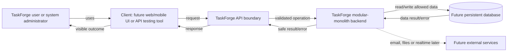
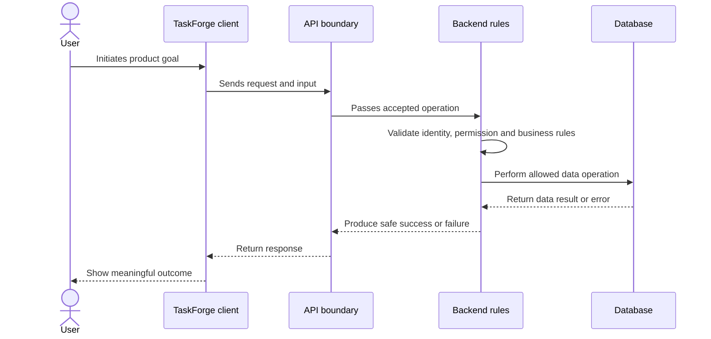

# TaskForge High-Level System Diagram

## Status and legend

Yeh **planned conceptual architecture** hai. Solid arrows expected core interaction
dikhate hain; dashed arrow later/optional integration dikhata hai. Current application
code, API, database and external services implement nahi hue.

## System context

## One operation round trip

## Responsibilities

- Actor: product goal initiate karta hai.
- Client: input collect, request send, response interpret/display karta hai.
- API boundary: supported operations and communication expectations expose karegi.
- Backend: trusted validation, identity, permissions, rules and coordination karega.
- Database: persistent data store/read/change karega.
- External services: email/file/realtime capability later justified need par.

## Trust boundary

Client user-controlled ho sakta hai, isliye backend client ke validation/hidden
buttons ko trust nahi karega. Protected rule backend mein independently enforce hoga.

