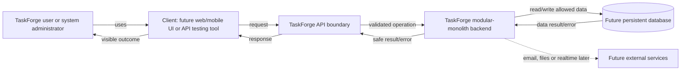
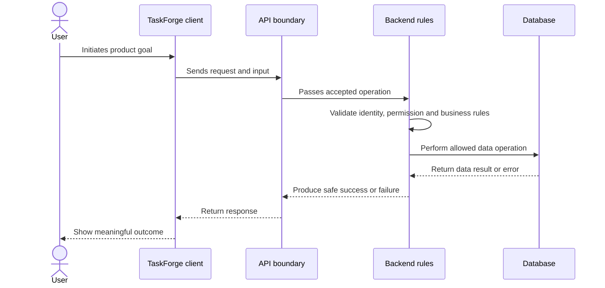

# Topic 14 — High-level system diagram

## Aaj ka exact objective

Aaj previous concepts ko ek high-level picture mein connect karna hai. Diagram batata
hai major system participants kaun hain aur information kis direction mein move hoti
hai. Detailed folders/classes/technology internals abhi diagram mein nahi aayenge.

## High-level diagram kya hota hai?

**High-level system diagram major actors, boundaries, components and relationships ko
implementation details ke bina visually explain karta hai.**

Yeh answer karta hai:

- system ko kaun use karta hai?
- system boundary kahan hai?
- major responsibilities kahan hain?
- data/request kis direction mein jata hai?
- result/error ka reverse path kya hai?
- external dependencies kahan ho sakti hain?

## TaskForge planned context diagram



Important: diagram future target relationship dikhata hai. Boxes ka hona code/files
ka exist karna prove nahi karta.

## Diagram left to right

### Actor

Registered user, workspace role ya system administrator product goal initiate karta
hai. Role current resource/workspace mein authority affect karegi.

### Client

Browser/mobile frontend future client ho sakta hai. Backend-first learning mein curl,
Postman ya Thunder Client bhi client role play karenge.

### API boundary

Supported operations, inputs and results ki communication boundary. Client internal
backend/database directly operate nahi karta.

### Modular-monolith backend

Ek deployable backend codebase/process ke andar feature responsibilities gradually
organize hongi. Backend validation, identity, permission, business rules, errors,
logging and coordination ka trusted location hoga.

### Persistent database

Users, memberships, projects, tasks and other durable state ko store/manage karega.
Backend allowed operations coordinate karega; frontend direct credentials nahi lega.

### External services

Email, object storage or realtime/queue infrastructure later real need par aa sakti
hai. Dashed connection “optional/later” indicate karta hai, current dependency nahi.

## Complete round trip



Model automatically first execute nahi hota. Future request server/API boundary par
arrive hoga; registered flow/middleware/controller/service/model order actual code
determine karega. Detailed layers Phase 13 mein aayengi.

## Forward and reverse flow

Forward:

```text
Actor -> client -> API -> backend rules -> database/service
```

Reverse:

```text
Database/service result -> backend safe translation -> API response -> client -> actor
```

Error bhi reverse flow follow karega, lekin internal secrets safely hidden rahenge.

## System boundary

TaskForge system boundary ke andar planned API/backend logic hai. Users/client and
external providers boundary ke outside participants ho sakte hain. Database internal
managed dependency hai, client-facing interface nahi.

System boundary security discussions mein useful hai: outside input untrusted maan
kar validate/authorize karna hoga.

## Trust boundary

```text
User-controlled client
        |
        | untrusted input
        v
Backend/API trust boundary
        |
        | validated + authorized operation
        v
Database/external dependency
```

Frontend validation UX improve karti hai; trusted enforcement backend mein hogi.

## Diagram abstraction level

High-level diagram intentionally nahi dikhata:

- exact routes/URLs;
- JavaScript functions/classes;
- Express middleware order;
- Mongoose schemas;
- MongoDB collections/indexes;
- server ports/process IDs;
- deployment machines/containers.

Too much detail overview ko unreadable banata. Detail separate diagrams mein relevant
topic par add hogi.

## Planned versus implemented view

### Planned

Actors, client, API, modular backend, database and later external services.

### Implemented today

```text
Learning/product/architecture Markdown documents only
```

No TaskForge application code, API endpoint, runtime process, database or integration
exists.

## Failure paths diagram se kaise read karein?

- Client/API boundary tak reach na ho -> no response/communication problem.
- Backend validation fail -> controlled client error, database write nahi.
- Permission fail -> forbidden operation stopped.
- Database fail -> backend false success nahi de.
- External service fail -> relevant operation retry/failure rule follow kare later.
- Response handling fail -> server result possible, client display still fail.

## Common misconceptions

1. **"Diagram ka box matlab component implemented hai."**  
   Planned diagram target concept ho sakta hai; current truth separately verify karo.

2. **"Database user/client ko response deta hai."**  
   Backend database result ko safe application response mein translate karega.

3. **"Frontend validation ke baad backend checks unnecessary hain."**  
   Client untrusted hai; backend independently enforce karega.

4. **"High-level diagram mein every file/function dikhani chahiye."**  
   Different abstraction levels ke separate diagrams better hain.

5. **"Request sirf database tak forward hoti hai."**  
   Backend identity, permission and business rules process karta hai.

6. **"External services abhi required/implemented hain."**  
   Diagram mein dashed optional future dependency hain.

## Verification strategy

Topic understood hai agar learner:

1. all major boxes and responsibilities explain kare;
2. forward request and reverse result flow trace kare;
3. system/trust boundary ka purpose bataye;
4. database ko client-facing component na kahe;
5. planned and implemented architecture distinguish kare;
6. explain kare high-level diagram implementation detail kyun omit karta hai.

## Quick self-check

1. Actor ke baad direct database kyun nahi?
2. API boundary ka purpose kya hai?
3. Trusted rules kahan enforce hongi?
4. Database result user tak kaunsa reverse path lega?
5. Dashed external-service arrow kya indicate karta hai?
6. Diagram se code existence prove hoti hai?

## Practice exercise

Diagram dekhe bina create-task flow draw/likho:

```text
Actor:
Client:
Forward path:
Trusted checks:
Persistent dependency:
Reverse path:
One failure before database:
One failure after database contact:
Current implementation truth:
```

<details>
<summary>Answer-after-attempt</summary>

```text
Actor: Authorized workspace member
Client: API testing tool or future frontend
Forward: actor -> client -> API -> backend
Checks: input, identity, workspace permission, business rule
Dependency: database
Reverse: database result -> backend -> API -> client -> actor
Before DB failure: validation/authorization rejection
After contact failure: database operation error safely translated
Current truth: documentation only, no running components
```

</details>

## Interview question with Hinglish answer

**Question:** TaskForge ka high-level architecture explain karo.

**Answer:** User future client ya API testing tool se operation initiate karega. Client
TaskForge API ko request bhejega. Modular-monolith backend input, identity, permission
aur business rules enforce karke allowed database/external-service work coordinate
karega. Result/error backend safe response mein translate karke API se client ko
lautayega. Database frontend se directly accessible nahi hoga. Abhi yeh planned
architecture hai; application components implement nahi hue.

## Easy-English minimum interview answer

**At a high level, a TaskForge client sends a request through the API to a modular
backend. The backend validates the input, checks identity and permissions, applies
business rules, and performs allowed database operations. It then returns a safe
success or error response to the client. External services will be added only when
needed.**

### Even shorter version

**Client requests go through the API to the backend, which applies rules, works with
the database, and returns a safe response.**

## Topic boundary

Topic 14 mein high-level system diagram complete hua. **Initial development phases**
Topic 15 ko iske baad separately complete kiya gaya.
